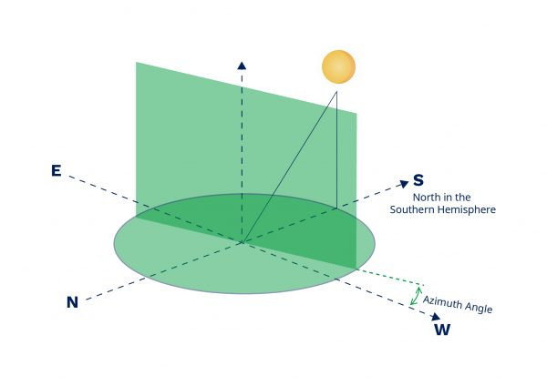
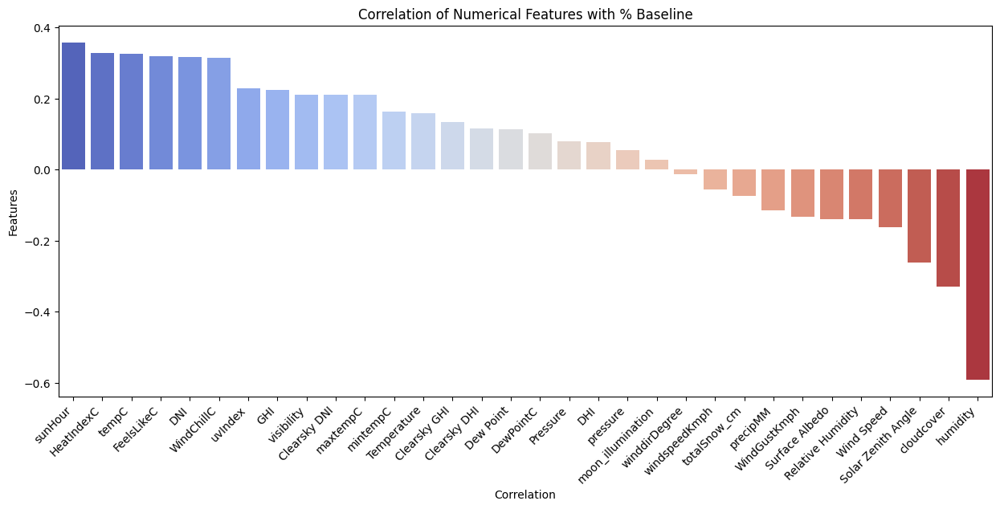
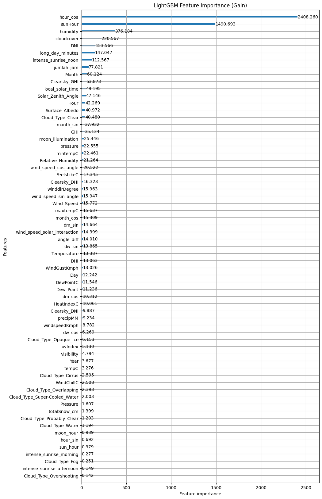
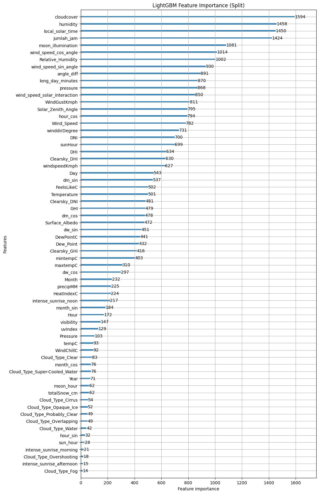

# Laporan Proyek Machine Learning - Ludy Hasby Aulia 

## Domain Proyek
Energi primer, melalui proses konversi energi, menghasilkan listrik. Sebagian besar energi primer ini berasal dari bahan bakar fosil, yang semakin menipis dan hampir tidak mungkin diperbarui dalam jangka pendek. Selain itu, penggunaan bahan bakar fosil berkontribusi terhadap polusi yang merusak lingkungan dan menimbulkan biaya tinggi untuk pengadaan bahan bakar. Di sisi lain, permintaan listrik terus meningkat seiring dengan pertumbuhan populasi manusia dan kemajuan teknologi. Oleh karena itu, diperlukan revolusi baru dalam penggunaan energi primer untuk pembangkit listrik.

Energi surya merupakan salah satu energi yang potensial untuk menggantikan bahan bakar fosil sebagai sumber energi primer pembangkit listrik. Energi surya tergolong terbarukan karena dapat dimanfaatkan secara bebas tanpa ada habisnya. Sel surya adalah perangkat yang mampu mengubah energi matahari menjadi energi listrik. Namun, tantangan dengan sel surya terletak pada biaya perangkat dan instalasi yang relatif tinggi, yang membutuhkan investasi tetap yang signifikan. Oleh karena itu, untuk mencapai Break Even Point (BEP) yang cepat, optimalisasi pembangkit listrik tenaga surya sangat penting. Optimalisasi ini dapat dicapai dengan mendesain instalasi seefisien mungkin. Alat utama yang dapat membantu dalam proses ini adalah Machine Learning, yang dapat belajar dari data historis tentang persentase energi yang dihasilkan relatif terhadap kapasitas penyimpanan, dengan mempertimbangkan kondisi cuaca, radiasi matahari, dan analisis deret waktu.

**Rubrik/Kriteria Tambahan (Opsional)**:
- Optimalisasi Penyerapan dan Konversi Surya ke Listrik sangat penting dengan tujuan membangun instalasi yang se efisien mungkin sehingga penggunaan sumber daya terbarukan dapat lebih efektif dan mencapai Break Even Point lebih cepat atas Biaya perangkat Instalasi yang relatif tinggi. 
- Mengapa Predictive Analytics diterapkan pada kasus tersebut ?
  analisis descriptive seperti analisis faktor-faktor yang berpengaruh penting pada kasus tersebut namun demikian ada beberapa manfaat yang didapat dari analisis predictive ini, diantaranya: 
  - Perencanaan dan pengoptimalan, dengan pemodelan predictive yang dibuat dapat direncanakan optimalisasi penggunaan energi yang lebih baik. Seperti, jika suatu hari dengan radiasi matahari tinggi, dapat diprioritaskan penggunaan energi surya. Sebaliknya, jika faktor lingkungan tidak mendukung, instalasi sistem panel surya dapat dibatalkan sehingga dapat mengurangi biaya instalasi nya. 
  - Pengambilan keputusan yang lebih baik, pemodelan predictive ini dapat digunakan untuk melakukan studi kelayakan lingkungan sebelum instalasi dilakukan pada daerah atau kawasan tertentu. Diharapkan, predictive ini akan membantu dalam pengambilan keputusan strategis seperti investasi energi terbarukan dalam bidang panel surya. 
- [7 factors that affect the performance of your solar system](https://www.hoymiles.com/resources/blog/7-factors-that-affect-the-performance-of-your-solar-system/)
Ada beberapa faktor yang berpengaru atas performa sistem surya, faktor tersebut dapat dibagi menjadi dua, yaitu Lingkungan dan Peralatan. 
  - Faktor Lingkungan, diantaranya sebagai berikut 
    - Radiasi, dimana banyaknya sinar matahari yang mengenai sistem surya berkorelasi positif dengan energi yang diserap oleh sistem panel surya. 
    - Temperatur, menurutnya temperatur yang lebih tinggi membuat output dari sistem panel surya semakin rendah (ketika panel surya memanas tegangan bahan semikonduktor dalam panel turun, yang membuat output saluran berkurang). Artikel ini memberikan saran bahwa temperatur yang baik dalam sistem panel surya antara 15 - 35 derajat celcius
  - Faktor Peralatan, diantaranya sebagai berikut 
    - Degradasi usia, panel surya dapat ekpektasikan mengalami degradasi 8-14% selama 25 tahun pertama setelah instalasi. 
    - Orientasi dan Tilt, kuncinya adalah menghitung sudut azimuth (arah kompas dari mana matahari berada, menempatkan panel pada kemiringan yang tetap tegak lurus dengan matahari). Jika di khatulistiwa utara, saluran harus menghadap ke selatan. 
    - Shading dan soliling. Shading atau bayangan, teramsuk kotoran dapat membuat penyerapan sinar matahari pada sistem konversi energi di panel surya tidak efektif.
    - Efisiensi Inverter akan membuat performa sistem panel surya lebih baik. 
      - Efisiensi Konversi 
      - Efisiensi MPPT
  - Dari Literature Review tersebut, akan digunakan sebuah pembuktian berdasar data historis apakah variabel tersebut berpengaruh terhadap optimalisasi konversi energi dari solar atau surya ke listrik dengan panel surya. Analisis ini akan berfokus pada faktor lingkungan, yaitu dari cuaca dan juga pola radiasi matahari. Dilain itu, akan juga diberikan banyak fitur yang menggambarkan lingkungan dan akan diungkap bagaimana hubungan diantara faktor-faktor tersebut secara linear (dengan regresi linear) maupun non linear (machine learning). Lalu akan dibuktikan bagaimana performa dari pemodelan terbaik atas prediksi yang dihasilkan jika variabel independen diketahui. 
 

## Business Understanding
### Problem Statements
- Fitur apa yang paling berpengaruh terhadap performa panel surya (%Baseline) ?
- Apa model yang paling baik dalam memprediksi besar performa sistem panel surya, jika di evaluasi RMSE atas data uji yang belum pernah di latih ?
- Berapa %Baseline (energi yang didapat selama sejam dari kapasitas baterai nya) dengan karakteristik atau fitur tertentu ? 

#### Goals
Menjelaskan tujuan dari pernyataan masalah:
- Mengetahui besaran korelasi atara fitur-fitur lingkungan dengan variabel respon (%Baseline). 
- Membuat pemodelan seakurat mungkin dan dapat memprediksi performa panel surya  atas faktor-faktor lingkungan yang ada. 

**Rubrik/Kriteria Tambahan (Opsional)**:
    ### Solution statements
    - Pemodelan linear akan dibangun dengan RidgeCV dan di evaluasi dengan metrik evalusi RMSE atas data uji dengan metode cross validation dengan fold = 5. 
    - Pemodelan non linear akan dibangun dengan pemodelan terpilih, yang seringkali akurat pada berbagai analisis terkait dengan data tabular/ terstruktur dengan library scikit learn. Pemodelan terpilih diantaranya Random Forest, XGBoost, dan Catboost. Pemodelan tersebut akan di evaluasi dengan metrik evaluasi RMSE atas data uji dengan metode cross validation dengan fold = 5. 
    - Pemodelan tersebut akan dipilih yang rerata RMSE cross validation tertinggi dan dilakukan improvement dengan hyperparamter tuning yang ditinjau atas metrik evalusi RMSE.

## Data Understanding
Dataset yang digunakan pada pemodelan prediktif ini terdiri atas 3 dataset, yaitu dataset utama (terdiri atas timestamp dan %Baseline), dataset solar irradiance (primary key timestamp), dan dataset cuaca (primary key timestamp). Adapun sumber data tersebut dapat diakses pada [link berikut](https://www.kaggle.com/competitions/preliminary-round-dac-prs-2024/data)
### Variabel-variabel pada dataset-dataset adalah sebagai berikut:
#### Dataset Utama
- %Baseline: persentase energi yang dihasilkan dalam satu jam berdasarkan kapasitas penyimpanan energi (Variabel Respons). 
- Timestamp: data waktu yang terdiri atas tahun, bulan, tanggal, jam, menit, dan detik. 
#### Dataset Solar Irradiance (Penyinaran Matahari)
- DHI (Diffuse Horizontal Irradiance): Kuantitas radiasi matahari yang diterima per satuan luas oleh permukaan horizontal dari semua arah kecuali matahari yang telah dihamburkan oleh molekul dan partikel di atmosfer (Watt per Meter Persegi).
- DNI (Direct Normal Irradiance): Jumlah radiasi matahari yang diterima per satuan luas oleh permukaan yang tegak lurus dengan sinar yang datang dalam garis lurus dari posisi matahari saat ini di langit. 
- GHI (Global Horizontal Irradiance): (Penyinaran Horizontal Global): Kombinasi DHI dan DNI yang mengikuti rumus di bawah ini: 
    GHI = DHI + DNI * Cos(θz) | θz adalah sudut zenith matahari. 
- Clearsky DHI: Radiasi DHI dalam kondisi langit cerah 
- Clearsky DNI: Radiasi DNI dalam kondisi langit cerah
- Clearsky GHI: Radiasi GHI dalam kondisi langit cerah. (Watt per meter persegi)
- Cloud Type: Klasifikasi jenis awan pada saat pengukuran
- Dew Point (titik embun): Suhu di mana udara menjadi jenuh dengan uap air dan uap air mulai mengembun. (Celcius)
- Solar Zenith Angle: Sudut antara sinar matahari dan arah vertikal selain sudut elevasi matahari. (Derajat)
- Surface Albedo : Indeks radiasi gelombang pendek yang dipantulkan dari tanah atau permukaan.
- Wind Speed: Kecepatan angin pada saat pengukuran. (Meter per detik)
- Relative Humidity: Jumlah kelembapan di udara dibandingkan dengan kelembapan yang dapat ditahan oleh udara pada suhu saat ini. (Persentase)
- Temperature: Suhu udara pada saat pengukuran. (Celcius)
- Pressure: Tekanan atmosfer pada saat pengukuran. (Milibar)

#### Dataset Cuaca
- maxtempC: Titik suhu maksimum suatu wilayah selama periode tertentu. (Celcius)
- mintempC: Titik suhu minimum suatu wilayah selama periode tertentu. (Celcius)
- totalSnow_cm: Total akumulasi ketinggian salju. (Sentimeter)
- sunHour: Perkiraan total jam sinar matahari.
- uvIndex: Indeks sinar UV yang dihasilkan oleh matahari.
- moon_illumination: Persentase iluminasi bulan (persentase permukaan bulan yang terpapar sinar matahari).
- moonrise: Waktu terbitnya bulan.
- moonset: Waktu terbenamnya bulan.
- sunrise: Waktu matahari terbit. 
- DewPointC: Suhu di mana udara menjadi jenuh dengan uap air dan uap air mulai mengembun. (Celcius)
- FeelsLikeC: Suhu yang dirasakan dengan mempertimbangkan berbagai faktor, seperti suhu udara
- HeatIndexC: Indeks panas yang dirasakan lebih panas daripada suhu udara yang sebenarnya karena faktor kelembapan. (Celcius)
- WindChillC: Indeks dinginnya angin yang dirasakan lebih dingin daripada suhu udara yang sebenarnya karena faktor angin. (Celcius)
- WindGustKmph: Kecepatan hembusan angin maksimum. (Kilometer per jam)
- cloudcover: Persentase cakupan awan.
- humidity: Persentase kelembaban udara. 
- precipMM: Curah hujan total (dalam satu meter persegi area datar dengan air hujan yang terkumpul hingga ketinggian tertentu dalam milimeter)
- pressure: Tekanan udara. (Milibar)
- tempC: Suhu udara pada saat pengukuran. (Celcius)
- visibility: Jangkauan penglihatan. (Kilometer)
- winddirDegree: Arah angin. (Derajat)
- windspeedKmph: Kecepatan angin rata-rata. (Kilometer per jam)

**Rubrik/Kriteria Tambahan (Opsional)**:
Untuk memahami data-data tersebut dengan baik dilakukan beberapa tahapan sebagai berikut 
- Data Wrangling, meliputi pengaksesan data dan mamahami format yang dimiliki oleh fitur setiap dataset. Dilajutkan dengan penggabungan atas ketiga dataset tesebut (terkecuali dataset solar irradiance dengan alasan memiliki missing value.)
- Descriptive analysis atau acessing data, digunakan untuk mendeskripsikan tipe data, sebaran data, dan nilai-nilai data yang mencurigakan. 
- Handling Missing Value, setelah pengecekan missing value ditemukan terdapat 2777 data bertipe numerik yang memiliki missing value (DHI, DNI, GHI, Clearsky DHI, Clearsky DNI, Clearsky GHI) dan 2486 data bertipe nominal (Cloud Type). Adapun treatment yang dilakukan adalah dengan melakukan interpolasi data bertipe data numerik dengan rerata nilai sebelum dan setelahnya. Interpolasi tersebut dilakukan mengingat data-data tesebut merupakan data runtut waktu sehingga alangkah lebih baik berhubungan dengan waktu sebelum dan setelahnya. Adapun fitur Cloud Type juga ditemukan kelas bernama 'unknown' sehingga diubahlah ke Null. Interpolasi missing value fitur ini dilakukan dengan mengisi missing value dengan data sebelumnya. 
- Analisis univariate, dilakukan untuk memahami data-data pada setiap fitur. Bagaimana data tersebar pada fitur-fitur tesebut, bagaimana bentuk distribusi datanya jika tipe datanya numerik. Pada analisis ini dapat disimpulkan bahwa data pada variabel respon % Baseline memiliki kecenderungan di bawah, yang berarti banyak panel yang kurang optimal, distribusi data miring ke kanan yang dapat berimplikasi pada pembangunan model.
- Analisis Multivariate, dilakukan untuk memahami hubungan antar variabel dalam dataset. Pada fitur Cloud Type disimpulkan Cloud Type dengan jenis Clear merupakan tipe Cloud Type yang mempunyai rerata % Baseline tertinggi yaitu sebesar (35%) dilanjutkan dengan Fog (26%) dan Probabily Clear (25%). Pada fitur bertipe numerik didapat hubungan yang beragam tiap fitur dengan % Baseline melalui pairplot. Melalui correlation bar, didapat bahwa sunHour, HeatIndexC, tempC merupakan fitur dengan korelasi positif tertinggi dengan % Baseline. Dilain sisi, humidity, cloudcover, dan Solar Zenith Angle adalah fitu dengan korelasi negatif tertinggi dengan % Baseline. 

## Data Preparation
Teknik yang dilakukan pada data preparation ini diantaranya adalah feature engineering dan transformasi data, train test split, dan standardization. 

**Rubrik/Kriteria Tambahan (Opsional)**: 
- Teknik feature engineering adalah teknik yang digunakan untuk melakukan pengembangan dan pemilihan fitur baru dengan melibatkan transformasi data. Hasil fitur baru tersebut diharapkan membuat data lebih bisa dipahami oleh mesin sehingga meningkatkan akurasi pemodelan yang dibuat. Adapun Feature engineering dan transformasi data yang dilakukan adalah sebagai berikut, 
  - Pengembangan fitur Season, yaitu membuat fitur musim apa yang terjadi saat timestamp tersebut. Adapun pembagian musimnya adalah menyesuaikan pemusiman bumi bagian barat, yaitu 
    - Musim winter (Desember - Februari)
    - Musim spring (Maret - Mei)
    - Musim Panas (Juni - Agustus)
    - Musim autumn (September - November)
  Selanjutnya fitur tersebut ditransformasikan ke dalam beberapa fitur hasil one hot encoding. 
  - Sun Hour dan Moon Hour, fitur ini dikembangkan guna menangkap informasi apakah timestamp tersebut berada dalam rentang matahari ada (terbit-terbenam) dan rentang bulan ada (terbit - terbenam). Kedua fitur tersebut adalah data bertipe dummy. 
  - Long Day (panjang relatif dengan matahari), fitur ini dikembangkan untuk menangkap informasi berapa lama hari tersebut matahari ada (dalam menit). Tipe data fitur ini adalah integer. 
  - intense sunrise, fitur ini dikembangkan untuk menangkap informasi apakah timestamp tersebut berada dalam kategori pagi, siang, sore, atau malam. Adapun pembagiannya adalah berdasar fitur sun_hour dan sunrise. Selanjutnya fitur kategorikal ini ditransformasikan menjadi data binary dengan one hot encoding. 
  - Encoding Cloud Type, fitur Cloud Type bertipe categorical. Oleh karena itu, supaya model bisa menangkap informasi data ini, dilakukan one hot encoding. 
  - Time Feature Extraction (fitur siklus dengan sinus dan cosinus). Fitur ini dikembangkan guna menangkap pola siklus data yang berbasis waktu, seperti hours (dalam sehari ada 24 jam, nah itu supaya bisa ditangkap bahwa setelah jam 24 itu jam 1 bukan jam 25), days (dalam sebulan ada 30 hari), weeks (satu bulan ada 4 minggu), months (dalam setahun ada 12 bulan). Sehingga model dapat lebih memahami natrual periodik dari data. Diharapkan prediksi nya lebih akurat karena yang akan diprediksi juga forecasting. Dengan proses transformasi sebagai berikut: 
  ````
  # making cyclical variables make sense if patterns occur 24/7/31
  def time_features(_df: pd.DataFrame, data_type:str='train') -> pd.DataFrame:
      df = _df.copy()
      hour = df["Hour"]
      dm = df["Day"]
      dw = train["Timestamp"].dt.dayofweek + 1
      month = df["Month"]
      for time, col in zip([hour, dm, dw, month], ['hour', 'dm', 'dw', 'month']):
          time_range = {
              'hour':24, 
              'dm': 31,
              'dw': 7,
              'month':12,
          }
          df[f'{col}_sin'] = np.sin(time*(2*np.pi/time_range[col]))
          df[f'{col}_cos'] = np.cos(time*(2*np.pi/time_range[col]))
      return df
  ````
- Train Test Split, disini digunakan pembagian dataset menjadi dua bagian, yaitu training set dan validation set. Tujuannya adalah agar kita tidak mengotori validation set dengan informasi yang didapat dari data latih. Adapun pembagiannya adalah 10% validation set, dan 90% training set. Alasan pembagian tersebut adalah data yang cukup besar, yaitu 18942 sehingga validasi 1895 data terasa cukup sehingga porsi belajar dapat lebih besar. 
- Standardisasi, dilakukan untuk kolom numerikal yang bukan hasil dari transformasi encoding. Standardisasi ini diaharapkan membantuk algoritma machine learning untuk menghasilkan performa yang lebih baik, sehingga dapat lebih konvergen. Standardisasi yang digunakan pada analisis ini adalah teknik StandarScaler yang ada pada library scikit learn dengan menghasilkan distribusi data bernilai -1 hingga 1, rerata 0, dan berstandar deviasi 1. 


## Modeling
Seperti yang dijelaskan sebelumnya, analisis ini menggunakan 5 pemodelan terpilih. Pemodelan tersebut akan dievalusi dengan metrik evaluasi RMSE dengan Cross Validation dengan Folds 5. Dari hasil evaluasi tersebut akan dipilih satu pemodelan yang memberikan RMSE terbaik dan dilakukan hyperparamater tunning sehingga menghasilkan pemodelan yang lebih baik. Pemodelan dan parameter base model yang dipilih diantaranya, 
- Ridge : linear_model.RidgeCV()
- Random Forest : ensemble.RandomForestRegressor(n_jobs=-1, random_state=STATE)
- XGBoost : xgb.XGBRegressor(n_estimators=200, random_state=STATE)
- Catboost : cb.CatBoostRegressor(verbose=0, random_state=STATE)
- LightGBM : lgbm.LGBMRegressor(n_estimators=1000, random_state=STATE)

**Rubrik/Kriteria Tambahan (Opsional)**: 
- Ridge Regression adalah pengemabangan dari metode regresi linear dengan regularisasi. Hal itu membuatnya lebih cepat untuk diimplementasikan dan memiliki interretasi yang mudah. Pemodelan ini cocok pada data yang sederhana dan bisa menangkap hubungan linear dalam permasalahan. Namun, karena pemodelan regresi linear, dia tidak bisa menangkap hubungan yang tidak linear. 
- Random Forest bisa menangkap hubungan non linear. Dengan teknik bagging, model ini cenderung robust dibandingkan dengan decision tree. Adapun kekurangannya, bagging nya random juga kurang interpretatif seperti Ridge.
- XGBoost, dikenal dapat menangani non linearitas yang kompleks juga dilengkapi dengan kontrol overfitting (L1 dan L2) sehingga dapat menghindari risiko overfitting. Kekuranganya, perlu tuning lama untuk dapat parameter terbaik. Hal itu dikarenakan hyperparameter yang banyak. 
- CatBoost, fitur kategori dapat diproses tanpa encoding dulu, kinerja tinggi pada default. Namun kekurangannya, komputasinya berat. 
- LightGBM, menggunakan teknik histogram dan leaf-wise growth yang membuatnya sangat cepat belajar pada dataset yang besar, dapat menangani data sparse. Namun seperti halnya Random Forest, LightGBM ini relatif sulit di interpretasi 
- Setelah dilakukan pemodelan, masing-masing pemodelan dievaluasi dengan hasil data uji sebagai berikut rmse(times taken): 
  - Ridge : 0.123(3.571 secs)
  - Random Forest : 0.08 (163.813 secs)
  - XGBoost : 0.076 (12.51 secs)
  - Catboost : 0.077 (76.871 secs)
  - LightGBM : 0.07 (37.435 secs)
- Oleh karena itu, pemodelan yang diambil pada analisis ini adalah LGBM regressor. Setelah dievaluasi berikut adalah fitur penting yang paling membantu berdasar Gain. 
Berikut adalah fitur penting yang paling membantu pembangunan LightGBM berdasar Split (fitur yang paling sering diguanakan atas keputusan split). 
- Setelah itu dilakukan hypertunning untuk menemukan paramter terbaik pada model LightGBM sehingga model dapat lebih akurat untuk melakukan prediksi. Adapun parameter yang di tunning dilakukan dengan Optuna, yang merupakan teknik pintar dengan optimisasi Bayesian. 
```
def objective(trial):
    params = {
        "objective": "regression",
        "metric": "rmse",
        "n_estimators":1000,
        "verbosity": -1,
        "bagging_freq":1,
        "learning_rate":trial.suggest_float("learning_rate", 1e-3, 0.1, log=True),
        "num_leaves": trial.suggest_int("num_leaves", 2, 2**10),
        "subsample":trial.suggest_float("subsample", 0.05, 1.0),
        "colsample_bytree": trial.suggest_float("colsample_bytree", 0.05, 1.0),
        "min_data_in_leaf": trial.suggest_int("min_data_in_leaf", 1, 100),
    }
    model = lgbm.LGBMRegressor(**params)
    model.fit(X_train, y_train)
    prediction = model.predict(X_val)
    rmse = mse(y_val, prediction, squared=False)
    return rmse
```

## Evaluation
- Setelah trial 200, didapat parameter terbaik sebagai berikut: 
  - 'objective': 'regression',
  - 'metric': 'rmse',
  - 'n_estimators': 1000,
  - 'verbosity': -1,
  - 'bagging_freq': 1,
  - 'learning_rate': 0.05062059210893609,
  - 'num_leaves': 760,
  - 'subsample': 0.7688131983798357,
  - 'colsample_bytree': 0.4027346291420229,
  - 'min_data_in_leaf': 42
- Dengan menerapkan parameter-parameter tersebut pada model dan dilakukan evaluasi dengan cross validation dengan fold = 5 didapat rmse data uji sebesar 0.0611 (terlihat progress yang sangat baik dibandingkan pemodelan base).
- Selanjutnya dilakukan postprocessing pada model, yaitu memanipulasi hasil prediksi. Kita dapat lihat dari permasalahan bahwa data target adalah persentase energi yang dihasilkan selama satu jam dibandingkan kapasitas baterainya. Sehingga nilainya harus berkisar antara 0 dan 1. Dengan demikian, nilai prediksi diluar tersebut harus diubah ke batas range. Dengan manipulasi tersebut didapat nilai rmse data uji sebesar 0.06107. Namun demikian, jika ditinjau dari data latih nilai tersebut sangatlah jauh dikarenakan RMSE data latih adalah 0.00899 (overfitting). 
- Adapun solusi dari permasalahan overfitting ini adalah dengan membangun pemodelan stacking dari beberapa pemodelan terpilih yang juga dilakukan hyper tunning. 
- Teknik stacking tidak dilakukan pada analisis ini dikarenakan membutuhkan waktu yang relatif banyak dan juga memerlukan proses trial dan error untuk model selection. 

**Rubrik/Kriteria Tambahan (Opsional)**: 
- Metrik evaluasi yang digunakan pada analisis ini adalah RMSE (Root Mean Squared Error). RMSE adalah hasil akar dari MSE (Mean Squared Erorr). MSE adalah rerata kuadrat dari perbedaan prediksi data y hat i dengan data aktual yi. Adapun rumus keduanya adalah sebagai berikut: 
Mean Squared Error (MSE):
$$\text{MSE} = \frac{1}{n} \sum_{i=1}^{n} (y_i - \hat{y}_i)^2$$
Root Mean Squared Error (RMSE):
$$\text{RMSE} = \sqrt{\frac{1}{n} \sum_{i=1}^{n} (y_i - \hat{y}_i)^2}$$
- Selain itu, untuk mencegah adanya overfitting pada prediksi data uji, evaluasi dilakukan dengan teknik validasi silang dengan pembagian data (folds) sebanyak 5. 
```
# Root Mean Square Error with Cross Validation 
def get_rmse(y_pred: np.array, y_true: np.array, folds:int=5)-> np.array:
    scores=np.zeros(folds)
    dpf = int(np.ceil(len(y_pred)/folds))
    for i in range(folds):
        start = i*dpf
        end = min((i+1)*dpf, len(y_pred))
        scores[i] = mse(y_pred[start:end], y_true[start:end], squared=False)
    return scores
```
Prosesnya adalah setelah data uji dibagi 5, kemudian dilakukan looping dan dihitung RMSE nya. Setelah itu didapat array score atas nilai RMSE setiap subset data itu. Lalu dirata-ratakan sebagai evaluasi tunggal. 

_Catatan:_
- Jika ada yang ditanyakan dapat menghubungi saya pada [email berikut](fewesgalih@gmail.com).