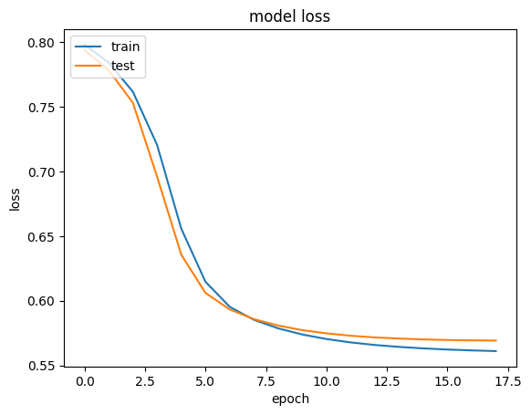
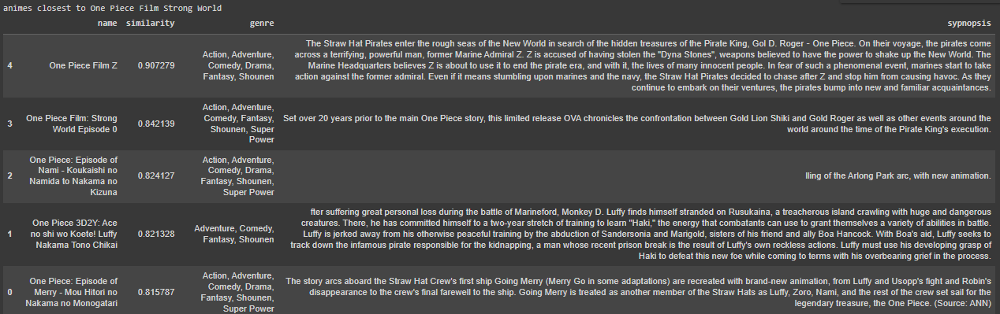
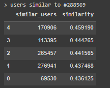
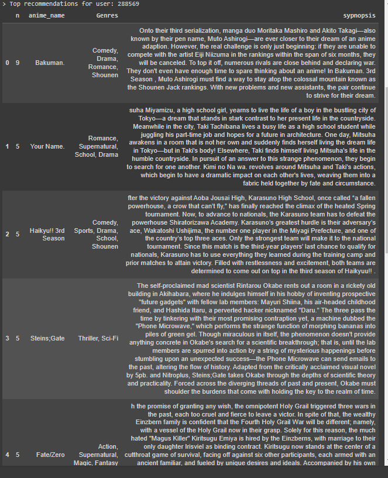
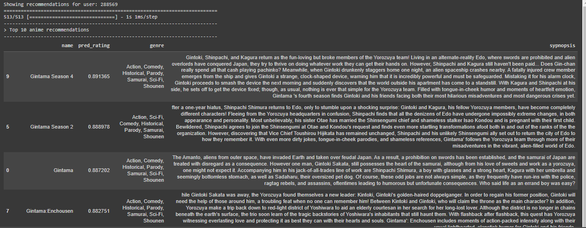

# Laporan Proyek Machine Learning - Ludy Hasby Aulia

## Project Overview
Industri hiburan anime terus mengalami pertumbuhan pesat seiring dengan meningkatnya popularitas platform streaming dan komunitas penggemar global. Hal ini menyebabkan lonjakan besar dalam jumlah judul anime yang tersedia, yang memicu tantangan baru bagi pengguna dalam menemukan konten yang sesuai dengan minat mereka. Dalam kondisi di mana pengguna sering kali merasa kewalahan dengan banyaknya pilihan, sistem rekomendasi yang efektif menjadi solusi krusial. Proyek pengembangan sistem rekomendasi berbasis **collaborative filtering** dengan pendekatan user-based dan item-based bertujuan untuk mengatasi masalah ini, memberikan pengalaman yang lebih personal, serta meningkatkan kepuasan pengguna. Sistem ini mampu membantu pengguna menemukan anime berdasarkan preferensi dan perilaku pengguna serupa (user-based) atau berdasarkan kesamaan antara anime yang telah dinilai (item-based). Dengan rekomendasi yang akurat, proyek ini diharapkan mampu meningkatkan keterlibatan pengguna pada platform anime.

Proyek ini penting diselesaikan karena keberhasilan sistem rekomendasi dapat membawa keuntungan besar bagi platform anime. Sistem yang memberikan rekomendasi relevan membantu pengguna merasa lebih terhubung dengan konten yang mereka nikmati, sehingga mendorong eksplorasi judul baru dan meningkatkan durasi pengguna menghabiskan waktu di platform. Selain itu, sistem ini juga meminimalkan “information overload” yang sering terjadi pada platform dengan konten berlimpah, sehingga pengalaman pengguna menjadi lebih positif dan personal. Dari perspektif bisnis, peningkatan keterlibatan ini juga dapat mengarah pada peningkatan loyalitas pengguna dan monetisasi platform yang lebih baik.

Sejumlah penelitian telah menunjukkan efektivitas pendekatan collaborative filtering dalam membangun sistem rekomendasi yang akurat. Misalnya, riset dari Sarwar et al. (2001) dalam [Item-based Collaborative Filtering Recommendation Algorithms](https://www.researchgate.net/publication/2369002_Item-based_Collaborative_Filtering_Recommendation_Algorithms) menyebutkan bahwa metode berbasis item mampu memberikan rekomendasi yang lebih efisien, terutama dalam skala dataset yang besar. Selain itu, dalam [Recommender Systems Handbook](https://www.researchgate.net/publication/227268858_Recommender_Systems_Handbook) yang disusun oleh Ricci et al. (2011), kombinasi antara pendekatan user-based dan item-based terbukti memberikan akurasi yang lebih tinggi dibandingkan dengan pendekatan tunggal. Dengan mengacu pada hasil riset ini, proyek pengembangan sistem rekomendasi anime diharapkan mampu memberikan dampak signifikan dalam meningkatkan pengalaman pengguna dan mendukung ekosistem hiburan anime yang lebih inklusif.

## Business Understanding
### Problem Statements
- Bagaimana pemodelan sistem rekomendasi anime dikembangkan sehingga dihasilkan rekomendasi anime yang lebih efisien dan akurat berdasar pola preferensi pengguna dengan pengguna lainnya (user based) ?
- Bagaimana pemodelan sistem rekomendasi anime dikembangkan sehingga dihasilkan rekomendasi anime yang lebih efisien dan akurat berdasar kesamaan anime yang ditonton antara pengguna satu dengan yang lain (item based) ?

### Goals
- Menemukan anime yang mirip (item similarity) dengan collaborative filtering. 
- Menemukan preferensi pengguna yang mirip (user similarity) dengan collaborative learning. 
- Dapat memberikan rekomendasi anime pada seorang user berdasar pemodelan yang telah dibangun. 

### Solution statements
- Pemodelan akan berfokus pada collaborative filtering (sistem rekomendasi melibatkan pengguna lainnya) dimana nantinya pemodelan collaborative learning akan menggunakan class RecommenderNet dengan keras Model class. 
- Metrik evaluasi yang akan digunakan adalah MSE (Mean Square Error) yang dihitung dengan rumus sebagai berikut: 

$\text{MSE} = {\frac{1}{n} \sum_{i=1}^{n} (y_i - \hat{y}_i)^2}$

## Data Understanding
Dataset yang digunakan pada analisis ini adalah dataset preferensi anime pada platform Open Source, Kaggle [Anime Recommendation Database 2020](https://www.kaggle.com/datasets/hernan4444/anime-recommendation-database-2020). Database tersebut berhasil mengumpulkan 17.562 anime dari 325.772 user yang bersumber dari [myanimelist.net](myanimelist.net). Anime yang terkandung didalamnya diantaranya daftar anime per pengguna. Termasuk yang sudah tamat, selesai, rencana untuk ditonton, sedang ditonton, dan ditunda.
rating yang diberikan oleh pengguna untuk anime yang telah mereka tonton sepenuhnya, informasi tentang anime seperti genre, statistik, studio, dll, HTML dengan informasi anime untuk melakukan scrapping data (berisi informasi seperti ulasan, sinopsis, informasi tentang staf, statistik anime, genre, dll.)

Adapun isi detail daripada dataset adalah sebagai berikut 
### Dataset animelist.csv
- user_id : id pengguna yang tidak dapat diidentifikasi yang dibuat secara acak.
- anime_id : id MyAnimeList dari anime. (Misalnya 1).
- score : skor antara 1 hingga 10 yang diberikan oleh pengguna. 0 jika pengguna tidak memberikan skor. (contoh: 10)
- watching_status: status ID dari anime ini dalam daftar anime pengguna tersebut. (Contoh: 2)
- watched_episodes: jumlah episode yang telah ditonton oleh pengguna. (Contoh: 24)
### Dataset watching_status.csv 
dataset ini menjelaskan setiap status yang mungkin dari kolom tersebut: 'watching_status' di animelist.csv.
### Dataset rating_complete.csv
adalah sebuah subset dari animelist.csv. Dataset ini hanya mempertimbangkan anime yang telah ditonton pengguna secara lengkap (status_menonton = 2) dan memberinya score (score!=0). Dataset ini berisi 57 Juta peringkat yang diberikan pada 16.872 anime oleh 310.059 pengguna. File ini memiliki kolom-kolom berikut:
- user_id: id pengguna yang tidak dapat diidentifikasi yang dibuat secara acak.
- anime_id: - ID MyAnimelist dari anime yang telah diberi peringkat oleh pengguna ini.
- rating: peringkat yang telah diberikan oleh pengguna ini.
### Dataset anime.csv
berisi informasi umum dari setiap anime (17.562 anime yang berbeda) seperti genre, statistik, studio, dll. File ini memiliki kolom-kolom berikut:
- MAL_ID: MyAnimelist ID of the anime. (e.g. 1)
- Name: full name of the anime. (e.g. Cowboy Bebop)
- Score: average score of the anime given from all users in MyAnimelist database. (e.g. 8.78)
- Genres: comma separated list of genres for this anime. (e.g. Action, Adventure, Comedy, Drama, Sci-Fi, Space)
- English name: full name in english of the anime. (e.g. Cowboy Bebop)
- Japanese name: full name in japanses of the anime. (e.g. カウボーイビバップ)
- Type: TV, movie, OVA, etc. (e.g. TV)
- Episodes': number of chapters. (e.g. 26)
- Aired: broadcast date. (e.g. Apr 3, 1998 to Apr 24, 1999)
- Premiered: season premiere. (e.g. Spring 1998)
- Producers: comma separated list of produducers (e.g. Bandai Visual)
- Licensors: comma separated list of licensors (e.g. Funimation, Bandai Entertainment)
- Studios: comma separated list of studios (e.g. Sunrise)
- Source: Manga, Light novel, Book, etc. (e.g Original)
- Duration: duration of the anime per episode (e.g 24 min. per ep.)
- Rating: age rate (e.g. R - 17+ (violence & profanity))
- Ranked: position based in the score. (e.g 28)
- Popularity: position based in the the number of users who have added the anime to their list. (e.g 39)
- Members: number of community members that are in this anime's "group". (e.g. 1251960)
- Favorites: number of users who have the anime as "favorites". (e.g. 61,971)
- Watching: number of users who are watching the anime. (e.g. 105808)
- Completed: number of users who have complete the anime. (e.g. 718161)
- On-Hold: number of users who have the anime on Hold. (e.g. 71513)
- Dropped: number of users who have dropped the anime. (e.g. 26678)
- Plan to Watch': number of users who plan to watch the anime. (e.g. 329800)
- Score-10': number of users who scored 10. (e.g. 229170)
- Score-9': number of users who scored 9. (e.g. 182126)
- Score-8': number of users who scored 8. (e.g. 131625)
- Score-7': number of users who scored 7. (e.g. 62330)
- Score-6': number of users who scored 6. (e.g. 20688)
- Score-5': number of users who scored 5. (e.g. 8904)
- Score-4': number of users who scored 4. (e.g. 3184)
- Score-3': number of users who scored 3. (e.g. 1357)
- Score-2': number of users who scored 2. (e.g. 741)
- Score-1': number of users who scored 1. (e.g. 1580)

### Exploratory Data Analysis
Untuk memahami data, juga dilakukan Exploratory data analysis yang befokus pada satu dataset. Dari EDA ini didapat bahwa rating berkisar pada range (1-10) dengan rerata pada 7,5 (negative skew). 
- Jumlah data data rating:  57633278
- Jumlah user yang memberikan rating:  310059
- Jumlah anime yang memiliki rating:  16872

## Data Preparation
Dikarenakan data rating sudah siap untuk dilakukannya analisis, teknik data preparation lebih berfokus pada pemilihan data yang ingi dipakai dalam pemodelan. Diantaranya: 
- Mengambil user dimana user adalah user yang telah memberikan rating setidaknya 400 rating. Dari pemilihan ini didapatkan 24573.682 user atau sekitar 42.64% dari data keseluruhan. Hal ini dilakukan guna meningkatkan kualitas pemodelan yang dibangun dengan mengambil user yang lebih aktif yang mempunyai banyak interaksi ke banyak item anime. Selain itu dengan pengambilan data user yang aktif akan mengurangi adanya noise yang disebabkan user pasif yang mungkin memberikan rating random pada suatu anime. 

### Notes: 
Disini akan difokuskan pada dataframe rating terlebih dahulu selanjutnya penggabungan data dilakukan setelah pemodelan dibangun, tujuan daripada hal tersebut adalah untuk berfokus pada peningkatan kinerja pemodelan, simplifikasi sehingga setelah pemodelan di buat akan diambil data yang diperlukan dari metadata yang ada. 

- Nantinya, setelah pemodelan item-based (anime) sudah dibangun, akan dibuatkan fungsi getAnimeName(animeId), getAnimeFrame(animeId), dan getSynopsis(anime) dari anime metadata yang akan mengambil informasi detail dari anime. 
- Begitupula dengan pemodelan user-based (penemuan similar users), setelah model menemukan user lain yang mempunyai user yang sama akan dibuatkan fungsi get_recommended_anime() dan mengambil detail rekomendasi anime dari anime metadata. 

## Data Preprocessing 
Teknik yang dilakukan pada data preprocessing ini diantaranya adalah: 
### pengecekan missing value 
Ditemukan tidak diperlukan handling missing value dikarenakan tidak ada missing value pada dataset. 
### normalisasi data rating
Normalisasi data rating dilakukan dengan teknik min-max normalization, dimana ingin mengubah nilai rating dari skala (1-10) menjadi (0-1). Teknik ini dilakukan dengan formula sebagai berikut : 

$ \text{rating\_scaled} = \frac{\text{rating} - \min(\text{rating})}{\max(\text{rating}) - \min(\text{rating})} $.

### Cek duplikasi
Setelah di lakukan pengecekan duplikat, tidak ditemukannya adanya duplikat pada dataset, sehingga tidak perlu handle duplicates. 
### tabel kontingensi rating pada top user dan top anime
Tabel kontingensi ini mengambil 20 user yang paling banyak melakukan rating, dan 20 anime yang paling banyak di rating. Selanjutnya dibangun tabel kontingensi yang menggambarkan jumlah total rating yang diberikan oleh user top pada setiap anime top. 
### encoding pada user dan anime data 
- Encoding (menyandikan) fitur user_id dan anime_id ke dalam indeks integer. 
- Setelah encoding dilakukan, dilakukan pengecekan jumlah anime dan jumlah user yang nantinya digunakan dalam pembangunan model. Diantaranya: 
   - Jumlah User: 35292, 
   - Jumlah Anime: 16844,
   - Min rating: 0.0,
   - Max rating: 1.0
### Train Test Split
- Sebelum data dibagi pada data latih dan data uji, dilakukan shuffling. Shuffling disini diterapkan untuk mencegah bias pada urutan data, sehingga train test split nantinya tidak dipengaruhi oleh urutan asli pada dataset. 
- Adapun fraksi yang digunakan untuk train adalah 90% dengan random_state = 123. 
   - Train set ratings: 22116313
   - Test set ratings: 2457369
- Setelah itu X train dan X test ditransformasikan kedalam array

## Modeling
### Detail Model Building
Pada tahap ini, model menghitung skor kecocokan antara pengguna dan anime dengan teknik embedding. Pertama, kita melakukan proses embedding terhadap data user dan anime. Selanjutnya, lakukan operasi perkalian dot product antara embedding user dan anime. Selain itu, kita juga dapat menambahkan bias untuk setiap user dan resto. Skor kecocokan ditetapkan dalam skala [0,1] dengan fungsi aktivasi sigmoid.
- Inisialisasi model dan layer Embedding: didalam RecommenderNet y(ang terinspirasi pada latihan sebelumnya), embedding layer digunakan unutk merepresentasikan pengguna dan anime dalam bentuk vektor berdimensi rendah. 
    ````
    user = Input(name = 'user', shape = [1]) 
    # konversi user_id menjadi vektor embedding berdimensi 128. 
    user_embedding = Embedding(name = 'user_embedding',
                       input_dim = n_users,
                       output_dim = embedding_size)(user) 

    anime = Input(name = 'anime', shape = [1])
    # konversi anime_id menjadi vektor embedding berdimensi 128. 
    anime_embedding = Embedding(name = 'anime_embedding',
                       input_dim = n_animes,
                       output_dim = embedding_size)(anime)
    ````
- Penggabungan Embedding (Dot Product)
    ````
    # dot product pada embedding user dan anime, juga normalisasi hasil dot product
    x = Dot(name = 'dot_product', normalize = True, axes = 2)([user_embedding, anime_embedding]) 
    # flatten hasil dot product untuk menjadi satu dimensi sehingga dapat diproses oleh layer selanjutnya
    x = Flatten()(x)
    ````
- Dense layer 
    ````
    x = Dense(1, kernel_initializer='he_normal')(x) # output layer: prediksi hasil, 'he_normal' untuk aktivasi non-linear
    x = BatchNormalization()(x) # normalisasi output dense layer
    x = Activation("sigmoid")(x) # output dijarikan rentang 0-1 kasus binaru (suka, tidak suka)
    ````
- Compile : loss function yang digunakan binary_crossentropy, adapun metrik evaluasi yang digukan mae dan mse 
- Pemodelan juga menggunakan Call_back 
    - learning rate scheduler : untuk kontrol learning rate
    - Model Checkpoint : menyimpan bobot model terbaik selama pelatihan berdasar val_loss 
    - Early Stopping : Menghentikan pelatihan jika model tidak ada peningkatan pada val loss pada 3 kali epoch berturut-turut.  

### Kelebihan dan Kekurangan Pemodelan 
Pemodelan berbasis embedding dan dense layers menawarkan banyak kelebihan, seperti efisiensi komputasi, kemampuan untuk menangkap pola kompleks, representasi yang lebih kompak, dan fleksibilitas dalam arsitektur. Metode ini sangat efektif untuk menangani dataset besar dalam sistem rekomendasi, memungkinkan model untuk mempelajari hubungan laten antara pengguna dan item secara efisien, serta memberikan prediksi yang akurat.


## Evaluation
- Seperti yang dijelaskan pada bagian sebelumnya metrik evaluasi yang diguanakan adalah MSE dan MAE. Setelah pelatihan dilakukan didapatkan history pelatihan pada loss binary_crossentropy sebagai berikut : . Dapat dilihat bahwa pemodelan mendapat nilai evaluasi sebagai berikut: 
    - mae training : 0.0868 
    - mse training : 0.0131 
    - mae testing : 0.0977 
    - mse testing : 0.0166
Pemodelan yang dihasilkan tidak menunjukkan overfitting. 

- Setelah itu, akan diekstrak bobot dari layer embedding dalam model. Sehingga didapatkan anime_weight dan user_weight
- Seperti di mention pada bagian sebelumnya, anime metadata akan dibuat untuk mengambil detail dari anime dan sinopsisnya. 
### Item Based Recommendation 
- pemodelan dapat memberikan rekomendasi anime yang mirip berdasarkan cosine similarity dari vektor embedding 
Input : 

````
find_similar_animes('One Piece Film Strong World', n=5, neg=False) # mengamnbil 5 rekomendasi dengan kemiripan tertinggi
````
Output : 

### User Based Recommendation 
- Pemodelan dapat mencari pengguna yang mirip (memiliki preferensi dengan pengguna yang diberikan)
- Proses dari fungsi 'find_similar_user()' adalah mengambil ID pengguna yang dicari, menghitung jarak antara embedding pengguna dan semua pengguna lainnya, dan mengurutkannya dalam n pengguna teratas. 
Demonstrasi : 
Input : 
````
similar_users = find_similar_users(288569, n=5, neg=False)

````
Output : 


- Setelah pemodelan mendapatkan similar_user, akan diberikan rekomendasi anime kepada user dari user yang mirip dengan preferensinya. Adapun fungsi yang menghandle adalah 'get_recommended_anime', fungsi ini akan mengambil daftar anime yang disukai oleh user yang mirip preferesnsinya tadi, lalu di filter yang belum ditonton oleh user yang direkomendasikan, selanjuntya anime_list yang direkomendasi akan diubah menjadi satu dimesi (flatten) untuk menghitung jumlah kemunculan setiap anime. Lalu diambil yang paling banyak muncul (diambil sebanyak n yang diminta). 
- Setelah dapat daftar anime yang di rekomendasikan, akan diambil informasi detail anime pada anime metadata dan mengembalikan ke user berupa informasi lengkap. 
Demonstrasi : 
Input : 
````
recommended_animes = get_recommended_animes(similar_users, n=10)
````
Output : 


### Rekomendasi berdasarkan peringkat (bonus)
Akan diberikan rekomendasi anime berdasarkan peringkat yang diprediksi menggunakan model yang telah dibangun. Adapun proses dari pemberian rekomendasi ini adalah sebagai berikut : 
- input user_id 
- mengambil list anime yang ditontoh oleh user
- meng-exclude list anime yang ditonton tersebut sehingga menjadi list anime yang belum ditonton
- Melakukan premrosesan berupa menjadikan nya dalam satu dimensi (flatten), lalu model akan memprediksi rating untuk anime yang belum ditonton. Simpan ke ratings_pred
- Lalu rekomendasi diberikan berdasar top prediksi rating yang mungkin diberikan oleh user 

Demonstrasi : 
Output : 


### Evaluasi atas Pemahaman Bisnis
- Pemodelan sistem rekomendasi anime berhasil dikembangkan dengan skor error yang relatif rendah (MSE) dan tidak menunjukkan overfitting yang berarti. 
    - mae training : 0.0868 
    - mse training : 0.0131 
    - mae testing : 0.0977 
    - mse testing : 0.0166
- Pemodelan yang dibangun berhasil memberikan rekomendasi baik pada item-based (berdasar ekstraksi embedding anime) maupun pada user-based (berdasar ekstraksi embedding user). 
- Rekomendasi yang diberikan relatif sesuai dengan uji coba yang dilakukan, sehingga dapat dikatakan pemodelan yang dibangun memenuhi ekspektasi atau tujuan yang ingin dicapai. 


Referensi : 
- Euclidian Distance and Cosine Similarity. (2017). https://doi.org/10.4135/9781526476593 
- Anime and Manga Database and Community. MyAnimeList.net. (n.d.). https://myanimelist.net/ 
- Sarwar, B., Karypis, G., Konstan, J., & Riedl, J. (2001). Item-based collaborative filtering recommendation algorithms. Proceedings of the 10th International Conference on World Wide Web. https://doi.org/10.1145/371920.372071 
- Valdivieso, H. (2021, July 13). Anime recommendation database 2020. Kaggle. https://www.kaggle.com/datasets/hernan4444/anime-recommendation-database-2020 
- Ricci, Francesco & Rokach, Lior & Shapira, Bracha. (2010). Recommender Systems Handbook. 10.1007/978-0-387-85820-3_1. 


_Catatan:_
- Jika ada yang ditanyakan dapat menghubungi saya pada [email berikut](fewesgalih@gmail.com).